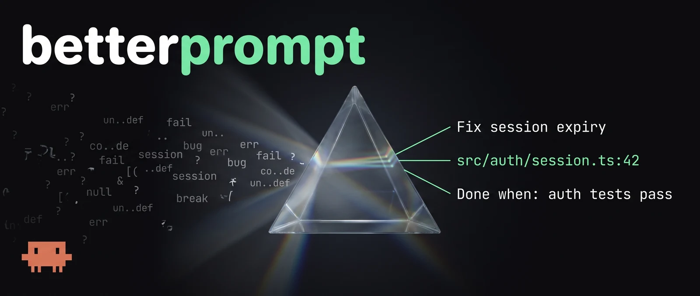
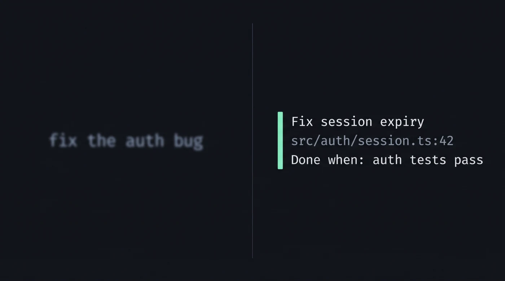

<p align="center">
  
</p>

# betterprompt

A Claude Code plugin that rewrites a rough prompt into a precise, context-grounded one, shows it to you, and waits for your approval before doing any work.

Two commands, same spine, different amount of your attention:

| | `/better` | `/evenbetter` |
|---|---|---|
| Grounds in repo + conversation | yes | yes, deeper |
| Asks you questions | no | 1–4, multiple choice |
| Unknowns end up as | *Open questions* you may ignore | answered before the rewrite |
| Your turns | 1 | 2 |

Both share the same spine: ground → scope-check → diagnose → rewrite → self-review → stop for approval.

## Why

Most of the cost of a bad result is a vague request. These put one cheap step in front of the work: resolve the vague nouns to real file paths, name the done-condition, state what's out of scope — then let you approve it.

## Install

```bash
/plugin marketplace add ~/Repos/betterprompt
/plugin install betterprompt@betterprompt
```

Once it's on GitHub, others can use the repo URL in place of the local path.

## `/better`

```
/better fix the auth bug
```

<p align="center">
  
</p>

Claude reads your conversation so far and the repo, then replies with:

- **Refined prompt** — a drop-in replacement you could paste into a fresh session
- **What changed** — which gap each edit closes
- **Assumptions** — anything inferred rather than confirmed
- **Open questions** — only genuine blockers, capped at three

Then it stops and asks whether to run it.

## `/evenbetter`

```
/evenbetter fix the auth bug
```

Same grounding, but Claude investigates *first* and then asks you what it genuinely can't determine — as multiple choice, with options naming real files and real trade-offs it found in your code:

```
Which refresh path is failing?
  › src/auth/session.ts:42 — rotation on renew (Recommended)
    src/middleware/auth.ts:88 — header validation
```

Its recommendation comes first, since it has already read the code. Answer, and it folds your choices in as stated facts — then produces the same refined prompt block and waits for approval.

The design bar is in the command file: **never ask what a grep would answer.** If grounding leaves nothing genuinely forked, it asks nothing and goes straight to the rewrite.

Use `/better` when you mostly know what you want and just want it sharpened. Use `/evenbetter` when the task is large, ambiguous, or expensive to get wrong.

Called with no argument, both target your most recent request in the conversation.

## Layout

```
.claude-plugin/
  plugin.json        plugin manifest
  marketplace.json   makes this repo installable as a one-plugin marketplace
commands/
  better.md          rewrite, then wait
  evenbetter.md      interrogate, rewrite, then wait
```

## Design notes

Both commands borrow structure from the `superpowers:brainstorming` skill, which solves an adjacent problem (turning an idea into an approved design):

- A `<HARD-GATE>` block instead of a polite "please wait" — with an explicit carve-out that read-only investigation is *not* doing the task, so grounding doesn't get chilled along with implementation.
- **Named anti-patterns** that quote the rationalization and rebut it. Rules get argued around; a rationalization written down and answered in advance is much harder to talk past.
- A **scope check** before refining, so a prompt that's really four requests gets decomposed rather than compressed into one bloated rewrite.
- A **self-review pass** — placeholders, ambiguity, invention, fidelity — before anything is shown. The ambiguity check matters most: "could this be read two ways" is precisely the defect these commands exist to remove, so it would be strange not to run it on their own output.
- A **checklist and process digraph** in `/evenbetter`, which makes the revision edge explicit: if you amend the refined prompt, it folds your edit in rather than re-interrogating you.

One thing deliberately *not* copied: brainstorming insists every project gets a design no matter how simple. These commands take the opposite line — a one-line prompt gets a one-line rewrite. Padding a simple request with invented constraints makes it worse, and that's named as an anti-pattern too.

## Tweaking it

Everything lives in the two files in `commands/`. Common changes:

- **Skip the approval gate** — remove the `<HARD-GATE>` block and the closing "and stop", and replace with an instruction to proceed directly.
- **Never execute** — drop the final paragraph so the command becomes a pure prompt-rewriting tool.
- **More or less repo digging** — the "bounded amount of effort" line in `better.md` Step 1, and "go deeper here" in `evenbetter.md` Step 1, are the dials.
- **Question count** — `evenbetter.md` Step 3 caps at four; the tool's own hard limit is four questions with four options each.
- **Let Claude invoke them** — both set `disable-model-invocation: true`, so only you can trigger them by typing the command. Drop that line to let Claude call them through the SlashCommand tool.
- **Pre-loaded shell context** — neither command injects shell output at expansion time; Step 1 gathers what it needs on demand. To pre-load some anyway, add `!`-prefixed backtick lines near the top, and see the note below on `allowed-tools` before you do.

### Why there's no `allowed-tools`

Both commands deliberately omit it. Official commands that inject shell output with `` !`cmd` `` pair it with an `allowed-tools` list — but that list also scopes the command's *action* tools, and these commands end by executing whatever prompt you approve, which could need anything. A restrictive list risks blocking the execution phase; a permissive one earns nothing. Dropping the shell injection removed the reason to declare it at all.
