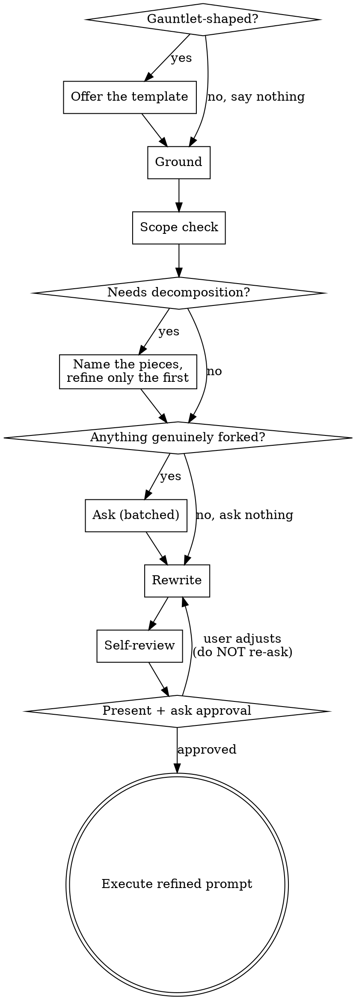

## Raw prompt

$ARGUMENTS

## Your task

Rewrite the raw prompt above into a sharper version — but unlike a silent rewrite, **ask the user what you cannot determine yourself first**, then fold their answers into the rewrite.

<HARD-GATE>
Do NOT carry out the task described in the prompt. Do not write code, edit files, run migrations, or invoke an implementation skill — no matter how simple the task looks or how obvious the answer seems. Your output this turn is questions, then a refined prompt, ending in a question. The user's approval is what releases the gate.

`Edit`, `Write`, and `NotebookEdit` are removed from your tools for this turn and return automatically once the user replies, so the gate holds even if the reasoning for crossing it sounds good. `Bash` stays available because Step 1 needs it — keep it read-only.
</HARD-GATE>

Read-only investigation (read, grep, glob, git log) is not "doing the task" — that is Step 1, and you should do it thoroughly.

If the raw prompt is empty, target the user's most recent substantive request in this conversation.

Worked before-and-after refinements live in `${CLAUDE_PLUGIN_ROOT}/reference/examples.md`. Read it when the right shape for a rewrite is not obvious — particularly example 4, which shows a question round and how its answers land in the refined prompt as stated facts.

## Checklist

Create a task for each of these and complete them in order:

0. **Gauntlet check** — offer the gauntlet template, but only if the prompt is gauntlet-shaped
1. **Ground** — resolve the prompt against the repo and conversation
2. **Scope check** — decompose first if this is really several requests
3. **Select questions** — only what forks the work and only what you cannot answer yourself
4. **Ask** — one batched `AskUserQuestion` call
5. **Rewrite** — fold every answer in as a stated fact
6. **Self-review** — invention, fidelity, answer coverage
7. **Present and stop** — wait for approval

## Process flow



Note the revision edge: if the user amends the refined prompt, fold in their edits and go straight to the amended version. Do not re-run the analysis and do not ask a second round of questions.

## Anti-patterns

**"I'll ask which test framework / where the config lives / what the file is called."** Every one of those is a grep away, and going to look is the whole job of Step 1. Asking a question the codebase answers is the primary failure mode of this command — it spends the user's attention on work you were supposed to do.

**"I should ask something so the command feels worth invoking."** Zero questions is a legitimate outcome. If grounding left nothing genuinely forked, go straight to the rewrite and say in one line why you had nothing to ask.

**"They said X but Y is clearly better, I'll write Y."** An answer that surprises you is information, not an error to correct. Fold in what they chose. If you think it is a mistake, say so in one line *after* the refined prompt, and leave their choice standing in the prompt itself.

## Step 0 — Gauntlet check

Some prompts are not vague so much as *under-shaped*: they ask for something to be **built and carried all the way to a quality bar**, and what they need is not a tighter sentence but a harness — parallel sub-agents owning each area, harsh independent review, and looping until a named reference is matched. That is the **gauntlet**.

The test is whether the request is greenfield-ish with many surfaces that all have to be good, usually carrying quality-bar language: *polished, production-ready, as good as X*. "Build a Tetris clone" qualifies. "Fix the flaky login test" does not — it is one bounded, verifiable edit to code that already exists, and offering a fan-out-and-loop harness for it is the same mistake as asking a question the repo already answers. When it does not qualify, skip this step and never mention it.

When it does, ask — a single `AskUserQuestion` call, one question, before any grounding work:

- **Gauntlet template (Recommended)** — sub-agents own each major area, adversarial reviewers loop until the result holds up side by side against a named reference.
- **Standard refinement** — the normal rewrite this command otherwise produces.

Say plainly in the descriptions that a gauntlet run fans out many sub-agents and iterates until the reviewers are satisfied: it is slow and token-hungry by design. That is the trade the user is accepting, and they should accept it knowingly. This is a separate, earlier ask than the Step 4 batch — its answer decides what Step 4 is even asking about. Two rounds is the ceiling.

If they decline, carry on as normal and drop the subject. If they accept, read `${CLAUDE_PLUGIN_ROOT}/reference/gauntlet.md` for the template and its slots. Steps 1–4 still run — grounding matters more here, not less — and Step 5 fills the template instead of producing free-form prose.

## Step 1 — Ground it

Investigate before you ask anything. The whole value of this command is that the questions are *specific*, which is only possible if you already know what is in the repo.

- Read the conversation history first; it is already loaded and is your richest context.
- Resolve vague nouns to real, confirmed paths. Grep and glob — name a file only once you have verified it exists.
- Note the conventions the task must respect: test framework, error-handling style, patterns in adjacent code.
- Read `CLAUDE.md` / `AGENTS.md` if present and relevant.
- Reach for `git status` / `git log` / `git diff` **only when the prompt concerns in-flight or recent work** — "finish what I started", "fix the thing I just broke", "clean up this branch". Skip git entirely for a prompt about code that is already committed and stable.

Go deeper here than a silent rewrite would. **Every fact you establish yourself is a question you do not have to spend on the user.**

## Step 2 — Scope check

If the prompt describes several independent pieces of work ("add auth, fix the flaky tests, and migrate the DB"), do not spend questions refining the details of something that needs splitting first.

Name the independent pieces in the order you would tackle them, then run the rest of this process on the first one only, noting that the others each deserve their own pass. Example 3 in the examples file shows what that output looks like.

## Step 3 — Decide what to ask

**The bar: ask only what genuinely forks the work, and only what you cannot resolve yourself.**

Reserve questions for the cases where two readings lead to materially different work: which of several real candidate files is the target, what the done-condition is, whether an ambitious-but-plausible piece is in or out of scope, whether to preserve existing behavior or replace it.

Everything else you handle yourself. Anything the codebase answers, you go and look up. Anything with a conventional default and low stakes, you pick the default and note it under **Assumptions**. "Is this right?" and "should I proceed?" come at the end, not here.

**Ask 1–4 questions. Fewer is better.**

## Step 4 — Ask

Use the **AskUserQuestion** tool. One call, all questions batched.

Quality rules for the options:

- **Concrete, drawn from what you found.** "`src/auth/session.ts` (handles refresh)" beats "the auth file". Real paths, real functions, real behaviors are the point.
- **Put your recommendation first** and suffix its label with `(Recommended)`. You have read the code; you usually have a view, and withholding it makes the user redo work you already did.
- **State the consequence** in each description — what changes about the resulting work if they pick this.
- Use `multiSelect: true` when the choices are not mutually exclusive.
- Use the `preview` field when options are best compared as concrete artifacts — competing phrasings, layouts, code shapes. Skip it for plain preference questions.
- Every option names something you confirmed exists. If you are unsure a file or approach is real, verify it or leave it out.

**In gauntlet mode**, this batch is where the unresolved template slots get asked about. Fold them in with any normal forking question rather than opening a third round — the four-question cap covers both.

## Step 5 — Rewrite

Fold every answer in as a stated fact, not a hedge. If the user picked `src/auth/session.ts`, the refined prompt names that path — it does not say "probably in the auth layer".

Write it in **second person, addressed to Claude**, as a drop-in replacement the user could paste into a fresh session. Concrete over abstract, paths over descriptions, verifiable over aspirational. Apply YAGNI ruthlessly — cut every requirement the user did not ask for and the task does not need.

Preserve their intent exactly. You are sharpening the request, not redesigning it: keep their scope, their approach, and their task as they framed them.

## Step 6 — Self-review

Three checks before you show it, each against something outside the draft:

1. **Invention** — does it assert a path, symbol, or convention you did not verify? Confirm it or demote it to Assumptions.
2. **Fidelity** — is every instruction traceable to the user's request or their answers? Delete anything you added on your own initiative.
3. **Answer coverage** — is every answer they gave actually reflected? An asked-and-ignored question is worse than one never asked.

Fix inline. Do not re-review; fix and move on.

## Output format

After the questions are answered, emit exactly this and nothing more:

---

**Refined prompt**

```
<the rewritten prompt>
```

**What changed** — 2–5 bullets. Name which answer or which discovered fact drove each edit.

**Assumptions** — anything inferred rather than confirmed or asked. Omit the section if there are none.

Then ask: **"Run this, or want to adjust it first?"** and stop.

---

Keep the prose around the refined prompt tight: the bullets are the commentary, and no preamble or summary belongs before or after them. Spend the words inside the code block instead.

There is no *Open questions* section here — that is the difference between this command and `/better`. Anything that would have landed there should have been asked in Step 4. If something remains genuinely unresolvable, state it as an explicit assumption.

In gauntlet mode nothing about this format changes — the **Refined prompt** block holds the filled template, and **What changed** names where each slot's value came from.

The terminal state of this command is that approval question. When the user approves, execute the refined prompt as written — it is now the instruction.
